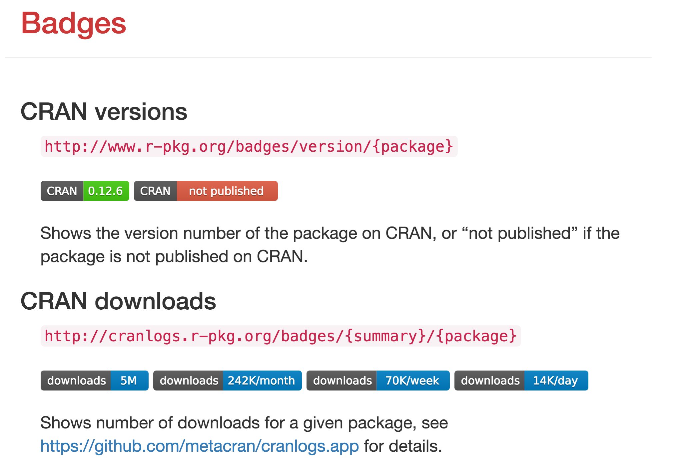

##

<h2 style="font-size:400%; margin-top:-80px;">
The bright past, present and future of R packages
</h2>

<h2 style="padding-top:6.5%;">Gábor Csárdi</h2>

<p style="line-height: 1">
gcsardi@mango-solutions.com
</p>


## Outline

<style type="text/css">
@import url("https://maxcdn.bootstrapcdn.com/font-awesome/4.6.3/css/font-awesome.min.css");
@import url("https://cdn.rawgit.com/gaborcsardi/r-font/master/rlogo.css");
</style>

1. My R story
2. The METACRAN experiment
3. The r-hub project
4. Final Thoughts

# My R story

## About myself

### R user/developer for ~14 years

### Computer science PhD, from ELTE

### Consultant at Mango Solutions &

### Developer of R-hub

### I like making tools for data analysis

### Co-main developer of `igraph` and several smaller packages

## { }


## { }


<!--

	2002. Eindhoven, Netherlands, TuE, Erasmus, during my MSc.  Got a
	Toshiba laptop, the old laptop of my Erasmus Advisor to write some fast
	hierarchical clustering implementations on it.

	Shrunk the windows partition, installed Linux on the remaining
	free space.

	Not much came out of the clustering project, but I also attended a
	course on Queueing theory, and this required coding up some
	simualations for various queues.

-->

## { .cover }


<!--

	This in turn needed the generation of random numbers from variouos
	distributions and some web search got me to R 1.5.0.  The competition
	at this time for (free or open source) scientific computing was Octave
	(a Matlab clone initially), and Scilab, at least the ones I knew of.
	GNUplot was used for plotting.  The was also GSL, which might have had
	some distributions, but no plotting.

	R 1.5.0 did have _a lot_ of annoying "features", but being able to
	sample from an exponential with a single function call was
	groundbreaking, as was the (according to those standards )nice
	documentation, and the (base!) plotting was genious.

-->

## { .cover }


## { .cover }


## { .cover }


## { .cover }


<!--

	I coded up my queue simulations and their visualization, and then
	forgot about R for a couple of months.

-->

<!--

	Later that year I helped my boss code up some simulations for networks
	research, and somehow discovered the R sna package. It was great!  It
	had a lot of network measures, some statistical models, which at that
	time I did not understand, and also some random networks. I worked
	together on this project with physicists and physisists always want to
	study the infinite. Small finite objects are not interesting for them.
	They wanted to know how our results scale as the network size is going
	to infinity. sna could not cope with it. So I wrote C code for these.

-->

##  { .cover }


<!--

	It occured to me that sna would be perfect for us, if it was just
    faster, so I emailed the maintainer and offered help with making it
    faster if he was interested. He was interested, so I got very
    motivated, and started rewriting sna in C. So in a couple months (?)  I
    rewrote much of sna in C, without ever communicating to the sna
    maintainer. Then I sent him an email with an R source package that had
    the next version of sna, which basically had not much to do with the
    old version.  I naively expected him to be happy about it, but I never
    got an answer from him about this, so he probably wasn't.

-->

##


<!--

	So this code, or rather the third rewrite of it, and contributions form
	my then colleague, Tamas, became the igraph package.

	Originally it was
	a good package. Small, simple. Then things started to creep in.
	External libraries like ARPACK, some of LAPACK,	etc. were embedded.

	I wanted to write a nice and smart API. Instead of writing

	x <- get.vertex.attribute(G, "weight")
	x[c("a", "b", "c")] <- 0
	G <- set.vertex.attribute(G, "weight", x)

	I wanted something like

	V(G)[c("a", "b", "c")]$weight <- 0

	and this was not trivial to implement. So the package got pretty
	messed up with non-standard evaluation, which is also quite slow.

	So later I tried to fix this while staying compatible with old code.
	Aaaaand the package got even more messed up. Right now it is pretty
	messed up. It does use weak references now, which required changing the
	internal structure of the data type.

	"At the time of writing no CRAN or Bioconductor package uses weak
	references." There is one now. (Actually there is four now.)

	Point is, sometimes it is just best to start over, and burn it all
	down. Start over. Or if that is too extreme for you, then just break
	the API badly. The only way to do this on CRAN now it to change the
	package name. See ggplot -> ggplot2, reshape -> reshape2, etc. Which is
	OK, but also not very nice.

	(At Harvard)

-->

<!--

	So I did try another way with igraph. The vertex indexing story, and
	igraph0. And so on...

-->

## How to break the API?

### Wanted to change 0-indexing to 1-indexing

### Proposed solution: `igraph0` package, compatible with *old* behavior

### CRAN suggested: create an `igraph2` package

### Disregarded advice, created `igraph0`

### CRAN Repository Policy:

> Introduction of packages providing back-compatibility versions
> of already available packages is not allowed.


# Why did R make it and others didn't?

## R was (and still is) *open*

### You could tinker with it easily

### Proper API, both in R and C

### Great documentation

### Great package system

### Fantastic mailing list

## R was (and still is) *well tested*

<div class="double">
<p class="double-flow">

### Easy installation (R & CRAN)

### `R CMD check`

### Packages are tested continuously

### 

</p><p class="double-flow">


</p>
</div>

# The METACRAN experiment

# Organizing information

## { }


## { }


## { }


## Search from R

```
❯ see("image", size = 15)
SAW "image" -------------------------------- 146 packages in 0.075 seconds ---
 #  # Title       # Package
 1  png           Read and write PNG images
 2  jpeg          Read and write JPEG images
 3  pixmap        Bitmap Images (``Pixel Maps'')
 4  tiff          Read and write TIFF images
 5  adimpro       Adaptive Smoothing of Digital Images
 6  bmp           Read Windows Bitmap (BMP) images
 7  OpenStreetMap Access to Open Street Map Raster Images
 8  Julia         Fractal Image Data Generator
 9  nat           NeuroAnatomy Toolbox for Analysis of 3D Image Data
 10 RImagePalette Extract the Colors from Images
 11 rasclass      Supervised Raster Image Classification
 12 OpenImageR    An Image Processing Toolkit
 13 Thermimage    Thermal Image Analysis
 14 osmplotr      Customisable Images of OpenStreetMap Data
 15 magick        Advanced Image-Processing in R

✔ 50.2 MiB
```

## CRAN download logs (from RStudio), `cranlogs`


```
❯ cran_downloads("igraph", "last-week")
        date count package
1 2016-08-26  1661  igraph
2 2016-08-27   824  igraph
3 2016-08-28   899  igraph
4 2016-08-29  1740  igraph
5 2016-08-30  1822  igraph
6 2016-08-31  1689  igraph
7 2016-09-01  2097  igraph

✔ 46.6 MiB
❯
```
## `cranlogs` shiny app (by David Robinson)


#  <br> CRAN @ GitHub

## { }


## { } 


## { }


## { }


## { }


## { }




<!--

	We started to use git and GitHub for igraph development, and this was
	much better than the bzr system we used before. Feature-wise they were
	almost the same (well for the features we used), but git was much nicer,
	and GitHub had nice code browsing.

	A couple of year later, after a long discussion on R-devel, which was
	initiated by Jeroen, btw., I decided that I liked the code browsing so
	much that I wanted to browse all CRAN packages on GitHub. I managed to
	get hold of the `cran` organization name, from Jeroen, btw., and then
	started mirroring all packages there.

	This required a watcher that queried CRAN every minute, so see if there
	was a new package release. Then the new releases were added to GitHub
	as a commit. After running the script over CRAN, I had ~6000
	repositories, and also added a script that keeps them up to date.

	The mirror has the benefit of indexing all code, so it is very easy to
	search it. If you want examples of how a given R function is used,
	you can find them easily.

	Search is important in general. YAhoo directory story.

	For search you need ranking and for ranking you need metrics.
	For metrics you could use things like: download statistics,
	number of reverse dependencies, etc. To make the search easy and fast
	these must be in a database. This is how the `crandb`, `cranlogs` and
	`seer` packages were born.

	Show examples for both.

	Having these packages, it was trivial to build a web site to search,
	show search results, etc.

	We also had a "Travis CI wrapper" to support multiple R versions.

-->

# The R Consortium

## { }


## The R Consortium

> The goal of the Consortium is to help with support and coordination of
> the important activities of the R Community. 

# The R-hub project

## { }


<!--

	It was in 2014, that RStudio, Revolution Computing, Google, ATT, people
    from Genetech put together a proposal for building a new package build
    and check service that would supersede R-forge. It would rely on more
    recent tools, e.g. GitHub, that were getting more adopted and standard.

	They were looking for somebody to do the actual work, and we chatted
	with JJ, RStudio's funder and CEO about this, as there were some
	similarities with what I did with METACRAN. I liked the idea, but my
	US didn't allow me to work for any other employer but Harvard.

	About one year later this project grew into the R Consortium.

	What is the R Consortium?

	And the project was named R-Hub by Dirk Eddelbuettel, and was funded
	by the consortium. It has been going on since the beginning of this
	year, slower than planned.

	Show architecture.

	sysreqs

	One-off checks.

	Linux platforms.

	rhub R package

-->

## { .cover }


## { .cover }


# Final thoughts

## Packages are still difficult

`devtools`, `testthat` and `roxygen2` (+ markdown soon) were a great
step towards easy package building.

```
f <- function() { ... }
```

When does this code run? At build? At install? At load?

```
f1 <- function(...) stats::lm(...)
f2 <- stats::lm
```

What's wrong with this code?

## Ease the burden

### On package maintainers

### On CRAN

### Hard to find the right package

## Can R compete with Python, JS, etc.?

The rule of least power by Tim-Berners-Lee:

> Computer Science spent the last forty years making languages which were
> as powerful as possible. Nowadays we have to appreciate the reasons for
> picking not the most powerful solution but the least powerful. The less
> powerful the language, the more you can do with the data stored in that
> language. If you write it in a simple declarative from, anyone can write
> a program to analyze it.

## Can R compete with Python, JS, etc.?

Atwood's law:

> any application that can be written in JavaScript, will eventually be
> written in JavaScript.

## A case for R

1. Mature foundation
2. Standard libraries rewritten gradually in packages. E.g.
   tidyverse.
3. Great graphics!
4. Great GUI(s) for data science.
5. More open than ever!
6. Better tested than ever!
